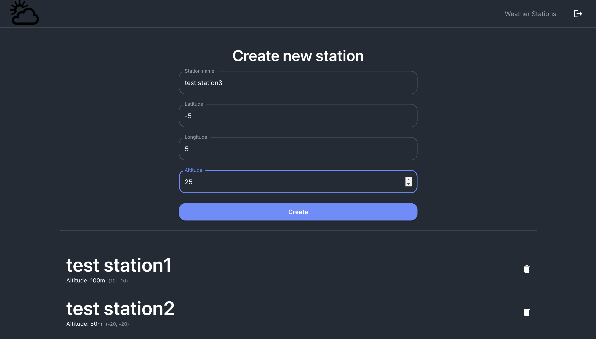

# The Weather App using CRA

This is a project template which uses and already has the following packages configured:

- [Redux Toolkit](https://redux-toolkit.js.org/)
- [react-router-dom v6](https://reactrouter.com/)
- [RTK-query](https://redux-toolkit.js.org/tutorials/rtk-query)
- [MUI5](https://mui.com/getting-started/installation/)
- [Formik](https://formik.org/)
- [Yup](https://github.com/jquense/yup)
- [Redux-persist](https://github.com/rt2zz/redux-persist#readme)
- [redux-persist-transform-encrypt](https://github.com/maxdeviant/redux-persist-transform-encrypt)
- [camelcase-keys](https://github.com/sindresorhus/camelcase-keys)
- [snakecase-keys](https://github.com/bendrucker/snakecase-keys)

This projects also uses a middleware on RTK-query to connect a React application with a snake case backend.

# Clone the project

```sh
git clone https://github.com/yurii-lubynets/weather-app.git
```

## Setup

### Requirements

Node >= 12

### Set environment variables

Create an **.env.development** and **.env.production** files on root folder and copy the content from **.env.example**. Feel free to change it according to your own configuration for development and production.

### Install packages

On the root folder run:

```sh
yarn install
```

### Start the project on development mode

In this mode the app reads and uses the **.env.development** environment variables
Open [http://localhost:3000](http://localhost:3000) to view it in the browser.

```sh
yarn start:development
```

### Start the project on production mode

In this mode the app reads and uses the **.env.production** environment variables
Open [http://localhost:3000](http://localhost:3000) to view it in the browser.

```sh
yarn start:production
```

### Test the code

```sh
yarn test
```

Launches the test runner in the interactive watch mode.\
See the section about [running tests](https://facebook.github.io/create-react-app/docs/running-tests) for more information.

### Create a production bundle

Builds the app for production to the `build` folder.\
It correctly bundles React in production mode and optimizes the build for the best performance.

The build is minified and the filenames include the hashes.\
Your app is ready to be deployed! It uses .env.production credentials

```sh
yarn build
```

## Preview

<p align="center">
  
</p>

<p align="center">
  
</p>
